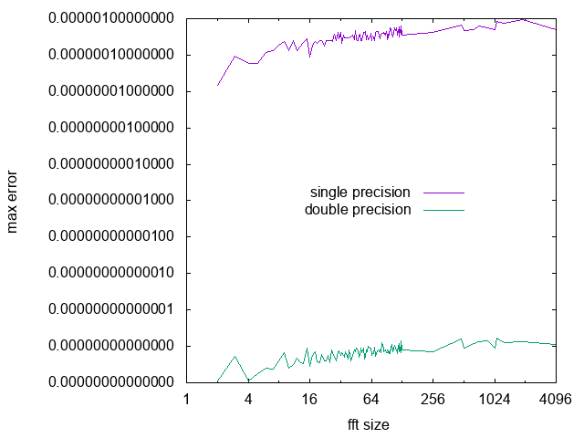

Simple and straightforward mixed radix DIT FFT implementation in C++11

It can do FFT of sizes:

N = 2^a * 3^b * 5^c * 7^d * 11^e * 13^f * 17^g * 19^h * 23^i * 29^j * 31^k

There are hand optimized kernels for radix-4 and radix-8

There is no real speed advantage of using single precision over double precision with this simple implementation:


More calculations mean larger errors but fortunately they do not grow that fast with increasing FFT size:



The above images are made from the following data and using gnuplot:

```
# make test
clang++ -stdlib=libc++ -std=c++11 -W -Wall -O3 -march=native benchmark.cc -o benchmark
./benchmark > /dev/null
size:    1 error:           0 after 100000000 ffts:           0 speed: 100000000000
size:    2 error: 1.11022e-16 after  25000000 ffts: 5.66105e-16 speed:    328947368
size:    3 error: 5.38916e-16 after  12895092 ffts: 2.69625e-09 speed:    134323875
size:    4 error: 1.11022e-16 after   8333332 ffts: 1.11022e-16 speed:    146198807
size:    5 error: 1.83192e-16 after   6020598 ffts: 1.24653e-15 speed:     69202275
size:    6 error: 2.48253e-16 after   4649048 ffts: 4.42717e-10 speed:     72641375
size:    7 error: 2.42365e-16 after   3752136 ffts: 3.18624e-12 speed:     52846985
size:    8 error: 4.00297e-16 after   3125000 ffts: 3.27704e-15 speed:     67934782
size:    9 error: 6.66134e-16 after   2664582 ffts: 7.12834e-10 speed:     30983511
size:   10 error: 2.48253e-16 after   2313782 ffts: 7.19443e-13 speed:     30850426
size:   11 error: 3.14018e-16 after   2038580 ffts: 5.62341e-12 speed:     25804810
size:   12 error: 4.65268e-16 after   1817534 ffts:  2.8464e-10 speed:     25243527
size:   13 error: 3.51083e-16 after   1636506 ffts: 1.88195e-10 speed:     20980846
size:   14 error: 3.33067e-16 after   1485818 ffts: 1.34036e-10 speed:     20927014
size:   15 error:  8.9509e-16 after   1358632 ffts: 3.67684e-10 speed:     18359891
size:   16 error: 2.77556e-16 after   1250000 ffts: 2.77556e-16 speed:     26041666
size:   17 error: 5.66105e-16 after   1156244 ffts: 1.40387e-10 speed:     13930650
size:   18 error: 7.02167e-16 after   1074590 ffts: 2.41786e-10 speed:     15351285
size:   19 error: 3.85593e-16 after   1002902 ffts: 1.22622e-10 speed:     11143355
size:   20 error: 3.51083e-16 after    939508 ffts: 7.84895e-11 speed:     14679812
size:   21 error: 6.14553e-16 after    883090 ffts: 1.72491e-10 speed:     12986617
size:   22 error: 3.96627e-16 after    832586 ffts: 9.95792e-11 speed:     10674179
size:   23 error: 4.00297e-16 after    787140 ffts: 1.44751e-10 speed:      7793465
size:   24 error: 5.66105e-16 after    746050 ffts: 1.95653e-10 speed:     12230327
size:   25 error: 3.51083e-16 after    708734 ffts: 5.63292e-11 speed:     10124771
size:   26 error: 8.00593e-16 after    674710 ffts: 2.63312e-10 speed:      8228170
size:   27 error: 6.47366e-16 after    643574 ffts: 1.93948e-10 speed:      9327159
size:   28 error: 5.11788e-16 after    614982 ffts: 1.23946e-10 speed:     10249700
size:   29 error: 4.00297e-16 after    588644 ffts: 7.04301e-11 speed:      4905366
size:   30 error: 7.02167e-16 after    564312 ffts: 1.87333e-10 speed:      8178434
size:   31 error:  7.4476e-16 after    541770 ffts: 1.30985e-10 speed:      4199767
size:   32 error: 5.55112e-16 after    520832 ffts: 9.12169e-11 speed:      9300571
size:   33 error: 6.86635e-16 after    501340 ffts: 1.31982e-10 speed:      6510909
size:   34 error: 5.55112e-16 after    483152 ffts: 1.10599e-10 speed:      4515439
size:   35 error: 4.96507e-16 after    466146 ffts: 6.94277e-11 speed:      6133500

*snip*

size: 1024 error: 8.88178e-16 after      8876 ffts:  2.7148e-12 speed:       145508
size: 1080 error: 1.66533e-15 after      8358 ffts: 7.14387e-12 speed:       101926
size: 1280 error: 1.24127e-15 after      6900 ffts: 3.09918e-12 speed:       111290
size: 1920 error: 1.36455e-15 after      4374 ffts: 2.59757e-12 speed:        63391
size: 4096 error: 1.11022e-15 after      1878 ffts: 7.56557e-13 speed:        32379
```
